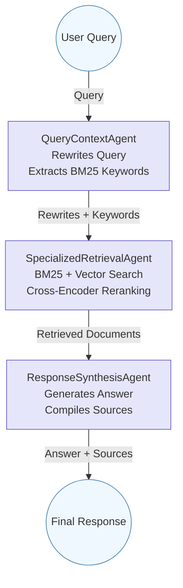

# Valley Air RAG Chatbot & Pipeline

A modular, production-grade Retrieval-Augmented Generation (RAG) system for the San Joaquin Valley Air Pollution Control District (Valley Air). This project enables web-scale document ingestion, semantic search, and conversational Q&A via both web and CLI interfaces.

---

## 🚀 What Does This Project Do?

- **Crawls** the Valley Air website, extracting and cleaning content.
- **Embeds** and **indexes** content into Elasticsearch using IBM watsonx.ai.
- **Retrieves** relevant information using both semantic (vector) and keyword (BM25) search.
- **Synthesizes** answers using a powerful LLM (IBM watsonx Granite).
- **Serves** a modern chatbot UI via Flask and Streamlit, and a CLI for power users.

---

## 🗂️ Codebase Structure

```
.
├── config.py              # Loads environment variables and constants
├── llm.py                 # LLM and embedding model setup (IBM watsonx)
├── vectorstore.py         # Elasticsearch connection and vector store logic
├── agents/                # All agent logic for the multi-step workflow
│   ├── query_context.py   # Query rewriting and keyword extraction agent
│   ├── retrieval.py       # Specialized retrieval agent (BM25 + vector)
│   └── synthesis.py       # Response synthesis agents (sync/streaming)
├── workflow.py            # LangGraph workflow and runner functions
├── web/                   # Flask web app and HTML template
│   └── routes.py          # Flask routes and chat UI
├── tests/                 # Test scripts and helpers
│   └── test_es.py         # Elasticsearch and embedding tests
├── chat_app.py            # Entry point for CLI and Flask app
├── app.py                 # Streamlit chat app (independent)
├── crawl_data.py          # Web crawler and markdown extractor
├── index_data.py          # Embedding and indexing pipeline
├── output/                # Markdown files (created by crawl_data.py)
├── requirements.txt
└── .env                   # Your environment variables
```

---

## 🧭 Pipeline Flow

### 1. **Crawling & Extraction** (`crawl_data.py`)
- Fetches all URLs from the Valley Air sitemap.
- Crawls each page, extracts main content, and saves as Markdown in `output/`.

### 2. **Embedding & Indexing** (`index_data.py`)
- Reads Markdown files, generates embeddings with IBM watsonx.ai, and indexes them into Elasticsearch.

### 3. **Conversational RAG Chatbot**
- **User query** enters the LangGraph workflow (see below).
- **QueryContextAgent**: Rewrites the query and generates BM25 keywords.
- **SpecializedRetrievalAgent**: Retrieves relevant docs using both BM25 and vector search, then reranks with a cross-encoder.
- **ResponseSynthesisAgent**: Synthesizes a concise, helpful answer using the LLM and retrieved context.

---

## 🤖 LangGraph Workflow



- **QueryContextAgent**: Expands the user query for better retrieval.
- **SpecializedRetrievalAgent**: Combines BM25 and vector search, deduplicates, and reranks results.
- **ResponseSynthesisAgent**: Uses the LLM to generate a final answer, citing sources.

---

## 🏗️ Key Modules & Functions

### `config.py`
- Loads all environment variables (Elasticsearch, IBM watsonx, etc).

### `llm.py`
- Sets up the LLM (IBM watsonx Granite) and embedding model.
- `IBMEmbeddingWrapper`: Adapter for embedding API.

### `vectorstore.py`
- Connects to Elasticsearch.
- `CustomElasticsearchStore`: Handles document creation and retrieval.

### `agents/`
- **query_context.py**: `QueryContextAgent` rewrites queries and generates keywords.
- **retrieval.py**: `SpecializedRetrievalAgent` performs hybrid retrieval and reranking.
- **synthesis.py**: `ResponseSynthesisAgent` and `StreamingResponseSynthesisAgent` generate answers.

### `workflow.py`
- Wires up the agents using LangGraph.
- `run_multiagent_workflow(user_query)`: Synchronous answer.
- `run_multiagent_workflow_streaming(user_query)`: Streaming answer (for web/Streamlit).

### `web/routes.py`
- Flask web app with a modern chat UI.
- `/` : Chat UI
- `/chat` : API endpoint for chat

### `app.py`
- Streamlit chat app with real-time streaming and chat history.

### `chat_app.py`
- CLI and Flask entry point.
- `--web` flag: Run Flask app.
- No flag: Run CLI chatbot.
- `--test` flag: Run ES/embedding tests.

### `tests/test_es.py`
- Diagnostic tests for Elasticsearch and embedding.

---

## 🖥️ How to Run

### 1. **Install dependencies**
```bash
python3.11 -m venv venv
source venv/bin/activate
pip install -r requirements.txt
```

### 2. **Set up `.env`**
See the sample in the old README or below.

### 3. **Crawl and index content**
```bash
python crawl_data.py
python index_data.py
```

### 4. **Run the chatbot**

#### **Web (Flask)**
```bash
python chat_app.py --web
# Visit http://localhost:5001
```

#### **CLI**
```bash
python chat_app.py
```

#### **Streamlit (Modern UI)**
```bash
python app.py
# Visit the Streamlit URL shown in the terminal
```

#### **Test Elasticsearch/Embedding**
```bash
python chat_app.py --test
```

---

## 📝 Function & Flow Explanations

- **Crawling**: `crawl_data.py` uses `crawl4ai` to fetch and clean content, saving as Markdown.
- **Indexing**: `index_data.py` chunks, embeds, and indexes content into Elasticsearch.
- **Query Handling**: User queries are rewritten, expanded, and used for both BM25 and vector search.
- **Retrieval**: Combines keyword and semantic search, deduplicates, and reranks with a cross-encoder.
- **Synthesis**: LLM generates a concise answer, citing sources.
- **Web/CLI/Streamlit**: All use the same backend workflow for consistent answers.

---

## ⚙️ Environment Variables

Create a `.env` file in the project root:

```env
# Elasticsearch
ES_URL=https://your-elasticsearch-url:port
ES_USER=your_es_username
ES_PASSWORD=your_es_password
ES_CERT_FINGERPRINT=your_es_ssl_fingerprint
ES_INDEX_NAME=valley_air_documents

# IBM watsonx.ai
IBM_CLOUD_API_KEY=your_ibm_cloud_api_key
IBM_CLOUD_ENDPOINT=https://your-ibm-cloud-endpoint
IBM_CLOUD_PROJECT_ID=your_ibm_project_id

# For LLM
WATSONX_URL=https://your-ibm-watsonx-url
WATSONX_PROJECT_ID=your_watsonx_project_id
```

---

## 🧪 Testing

- Run `python chat_app.py --test` to check Elasticsearch and embedding connectivity and sample queries.

---

## 📚 Further Reading

- See `crawl_data.py` and `index_data.py` for details on crawling and indexing.
- See `agents/` for agent logic and prompt engineering.
- See `workflow.py` for the LangGraph workflow definition.

---

## 📞 Contact

For questions about this program, please email vmahalingam@daisourceconsult.com
or call @ +91 9940683288

--- 