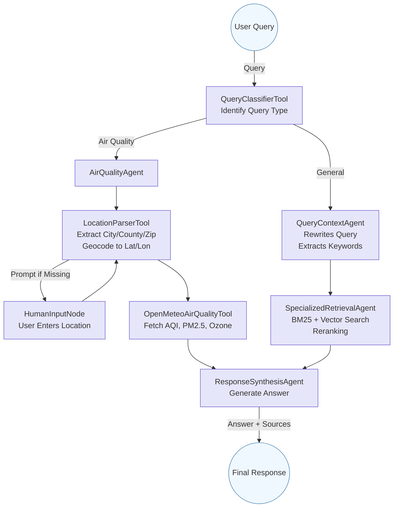

# Valley Air RAG Chatbot & Pipeline

A modular, production-grade Retrieval-Augmented Generation (RAG) system for the San Joaquin Valley Air Pollution Control District (Valley Air). This project enables web-scale document ingestion, semantic search, and conversational Q&A via both a modern Streamlit UI, Flask web, and CLI interfaces.

---

## 🚀 What Does This Project Do?

- **Crawls** the Valley Air website, extracting and cleaning content.
- **Embeds** and **indexes** content into Elasticsearch using IBM watsonx.ai.
- **Retrieves** relevant information using both semantic (vector) and keyword (BM25) search, then reranks with a cross-encoder.
- **Synthesizes** answers using a powerful LLM (IBM watsonx Granite).
- **Serves** a modern chatbot UI via Streamlit (with streaming, chat history, reset, and transcript download), Flask, and a CLI for power users.
- **Air Quality Agent**: Real-time air quality answers and charts for San Joaquin Valley cities/counties, using Open-Meteo APIs and robust location validation.
- **Privacy-first**: All chat is stateless and not stored server-side.

---

## 🖥️ Streamlit Chatbot UI

- **Real-time streaming**: Answers stream in as the LLM generates them.
- **Chat history**: See your full conversation, including sources for each answer.
- **Reset**: Instantly clear your chat history.
- **Download transcript**: Save your conversation as a text file.
- **Context display**: See how your query was expanded and what keywords were used for retrieval.
- **Source attribution**: Every answer cites its sources (or notes if none are available).
- **Air quality charting**: For air quality queries, see a real-time chart of pollutant levels (PM2.5, Ozone, etc.) for your location, powered by Open-Meteo.
- **Conversational location prompts**: If a location is missing or invalid, the chatbot will ask for it in the chat, and your next message is treated as the location.
- **Robust error handling**: The UI and backend handle missing/null values, LLM quirks, and out-of-area queries gracefully.
- **No data retention**: Your chat is private and not stored on the server.

---

## 🗂️ Codebase Structure

```
.
├── config.py              # Loads environment variables and constants
├── llm.py                 # LLM and embedding model setup (IBM watsonx)
├── vectorstore.py         # Elasticsearch connection and vector store logic
├── agents/                # All agent logic for the multi-step workflow
│   ├── query_context.py   # Query rewriting and keyword extraction agent
│   ├── retrieval.py       # Specialized retrieval agent (BM25 + vector + cross-encoder)
│   ├── synthesis.py       # Response synthesis agents (sync/streaming)
│   ├── air_quality_agent.py # AirQualityAgent for Open-Meteo API, location validation, and charting
│   └── air_quality_tools.py # OpenMeteoTools for geocoding, validation, and API calls
├── workflow.py            # LangGraph workflow and runner functions
├── app.py                 # Streamlit chat app (modern UI)
├── chat_app.py            # Entry point for CLI and Flask app
├── web/                   # Flask web app and HTML template
│   └── routes.py          # Flask routes and chat UI
├── crawl_data.py          # Web crawler and markdown extractor
├── index_data.py          # Embedding and indexing pipeline
├── output/                # Markdown files (created by crawl_data.py)
├── tests/                 # Test scripts and helpers
│   └── test_es.py         # Elasticsearch and embedding tests
├── requirements.txt
└── .env                   # Your environment variables
```

---

## 🧭 Pipeline Flow

### 1. **Crawling & Extraction** (`crawl_data.py`)
- Fetches all URLs from the Valley Air sitemap.
- Crawls each page, extracts main content, and saves as Markdown in `output/`.

### 2. **Embedding & Indexing** (`index_data.py`)
- Reads Markdown files, generates embeddings with IBM watsonx.ai, and indexes them into Elasticsearch.

### 3. **Conversational RAG Chatbot**
- **User query** enters the LangGraph workflow (see below).
- **QueryClassifierTool**: Classifies the query as 'air_quality' or 'general' for conditional routing.
- **QueryContextAgent**: Rewrites the query and generates BM25 keywords.
- **SpecializedRetrievalAgent**: Retrieves relevant docs using both BM25 and vector search, then reranks with a cross-encoder.
- **AirQualityAgent**: For air quality queries, validates location, fetches Open-Meteo data, and streams both a chart and a synthesized answer.
- **ResponseSynthesisAgent**/**StreamingResponseSynthesisAgent**: Synthesizes a concise, helpful answer using the LLM and retrieved context, with streaming support for the UI.

---

## 🤖 Multi-Agent Workflow (LangGraph)



- **QueryClassifierTool**: Classifies queries as 'air_quality' or 'general' for conditional routing.
- **AirQualityAgent**: Handles air quality queries, robustly extracts and validates location, fetches Open-Meteo data, and streams both a chart (time series DataFrame) and a synthesized answer. Handles LLM quirks and user input errors gracefully.
- **QueryContextAgent**: Expands the user query for better retrieval (rewrites + BM25 keywords).
- **SpecializedRetrievalAgent**: Combines BM25 and vector search, deduplicates, and reranks results with a cross-encoder.
- **ResponseSynthesisAgent**/**StreamingResponseSynthesisAgent**: Uses the LLM to generate a final answer, citing sources, with streaming for the UI.

---

## 🏗️ Key Modules & Functions

### `app.py`
- Streamlit chat app with real-time streaming, chat history, reset, transcript download, and context display.
- **Air quality charting**: For air quality queries, displays a real-time chart and answer. For general queries, displays answer and sources.
- **Conversational location prompts**: If a location is missing or invalid, the chatbot prompts for it in the chat, and the next user message is treated as the location.
- **Robust chat history logic**: Ensures both query context and answers are always visible in the correct order for both air quality and general queries.
- Stateless: All chat history is session-based and not stored server-side.

### `workflow.py`
- Wires up the agents using LangGraph.
- `run_multiagent_workflow(user_query)`: Synchronous answer.
- `run_multiagent_workflow_streaming(user_query, callback_handler)`: Streaming answer (for Streamlit UI), with callback support for real-time token and event updates.
- **Conditional routing**: Uses QueryClassifierTool to route queries to AirQualityAgent or the general retrieval/synthesis pipeline.

### `agents/`
- **query_context.py**: `QueryContextAgent` rewrites queries and generates keywords for hybrid retrieval.
- **retrieval.py**: `SpecializedRetrievalAgent` performs hybrid retrieval (BM25 + vector), deduplication, and cross-encoder reranking.
- **synthesis.py**: `ResponseSynthesisAgent` and `StreamingResponseSynthesisAgent` generate answers, with streaming support for the UI. Now always yields an 'answer' event for general queries.
- **air_quality_agent.py**: `AirQualityAgent` robustly extracts and validates location, fetches Open-Meteo data, and streams both a chart and a synthesized answer. Handles LLM quirks and user input errors gracefully.
- **air_quality_tools.py**: `OpenMeteoTools` for geocoding, validation, and Open-Meteo API calls. Accepts only valid San Joaquin Valley locations.

### `vectorstore.py`
- Connects to Elasticsearch.
- Handles document creation, retrieval, and metadata enrichment.

### `llm.py`
- Sets up the LLM (IBM watsonx Granite) and embedding model.

### `chat_app.py`
- CLI and Flask entry point.
- `--web` flag: Run Flask app.
- No flag: Run CLI chatbot.
- `--test` flag: Run ES/embedding tests.

### `tests/test_es.py`
- Diagnostic tests for Elasticsearch and embedding.

### 🔄 Real-Time Streaming & Callback Handlers

The Streamlit UI leverages a **callback handler** and event-driven streaming to provide a responsive, interactive chat experience:

- **StreamingResponseSynthesisAgent** and **QueryContextAgent** both support streaming output and event callbacks.
- The `StreamlitCallbackHandler` in `app.py` receives:
  - **LLM tokens** as they are generated (for real-time answer streaming)
  - **Tool events** (e.g., when retrieval or context expansion starts)
  - **Query context** (rewrites and keywords used for retrieval)
  - **Completion events** (when the answer and sources are ready)
- The callback handler updates the UI in real time, showing partial answers, context, and sources as soon as they are available.

**Event types include:**
- `token`: A new token from the LLM (for streaming answer display)
- `tool`: A tool/agent has started or completed an action (e.g., retrieval)
- `query_context`: The agent has generated query rewrites and keywords
- `answer`: The synthesized answer and sources (for both air quality and general queries)
- `air_quality`: The time series DataFrame for charting (air quality queries only)
- `location_needed`: The agent needs a valid location (air quality queries only)
- `done`: The answer and sources are finalized

**Relevant code:**
- See `app.py` for the `StreamlitCallbackHandler` and event handling logic.
- See `workflow.py` for how agents emit events and how the callback handler is integrated.

This architecture ensures the user sees immediate feedback and context, making the chatbot feel fast and interactive.

---

## 🖥️ How to Run

### 1. **Install dependencies**
```bash
python3.11 -m venv venv
source venv/bin/activate
pip install -r requirements.txt
```

### 2. **Set up `.env`**
See the sample below.

### 3. **Crawl and index content**
```bash
python crawl_data.py
python index_data.py
```

### 4. **Run the chatbot**

#### **Streamlit (Modern UI)**
```bash
python app.py
# Visit the Streamlit URL shown in the terminal
```

#### **Web (Flask)**
```bash
python chat_app.py --web
# Visit http://localhost:5001
```

#### **CLI**
```bash
python chat_app.py
```

#### **Test Elasticsearch/Embedding**
```bash
python chat_app.py --test
```

---

## 📝 Function & Flow Explanations

- **Crawling**: `crawl_data.py` uses `crawl4ai` to fetch and clean content, saving as Markdown.
- **Indexing**: `index_data.py` chunks, embeds, and indexes content into Elasticsearch.
- **Query Handling**: User queries are classified, rewritten, expanded, and used for both BM25 and vector search.
- **Retrieval**: Combines keyword and semantic search, deduplicates, and reranks with a cross-encoder.
- **Synthesis**: LLM generates a concise answer, citing sources, with streaming for the UI. Air quality answers include a real-time chart.
- **Web/CLI/Streamlit**: All use the same backend workflow for consistent answers.

---

## ⚙️ Environment Variables

Create a `.env` file in the project root:

```env
# Elasticsearch
ES_URL=https://your-elasticsearch-url:port
ES_USER=your_es_username
ES_PASSWORD=your_es_password
ES_CERT_FINGERPRINT=your_es_ssl_fingerprint
ES_INDEX_NAME=valley_air_documents

# IBM watsonx.ai
IBM_CLOUD_API_KEY=your_ibm_cloud_api_key
IBM_CLOUD_ENDPOINT=https://your-ibm-cloud-endpoint
IBM_CLOUD_PROJECT_ID=your_ibm_project_id

# For LLM
WATSONX_URL=https://your-ibm-watsonx-url
WATSONX_PROJECT_ID=your_watsonx_project_id
```

---

## 🧪 Testing

- Run `python chat_app.py --test` to check Elasticsearch and embedding connectivity and sample queries.

---

## 🧩 Extending & Customizing Agents

- **Add new agents**: Create a new agent in `agents/` and add it to the workflow in `workflow.py` using LangGraph.
- **Customize prompts**: Edit the prompt templates in `agents/query_context.py` or `agents/synthesis.py` for different behaviors or domains.
- **Change retrieval logic**: Modify `SpecializedRetrievalAgent` in `agents/retrieval.py` to adjust how BM25, vector, or reranking is performed.
- **Swap LLMs or embeddings**: Update `llm.py` and `vectorstore.py` to use different models or providers.
- **UI customization**: Edit `app.py` for Streamlit UI changes, or `web/routes.py` for Flask.

---

## 📚 Further Reading

- See `crawl_data.py` and `index_data.py` for details on crawling and indexing.
- See `agents/` for agent logic and prompt engineering.
- See `workflow.py` for the LangGraph workflow definition.
- See `app.py` for Streamlit UI logic and callback streaming.

---

## 📞 Contact

For questions about this program, please email vmahalingam@daisourceconsult.com
or call @ +91 9940683288

--- 